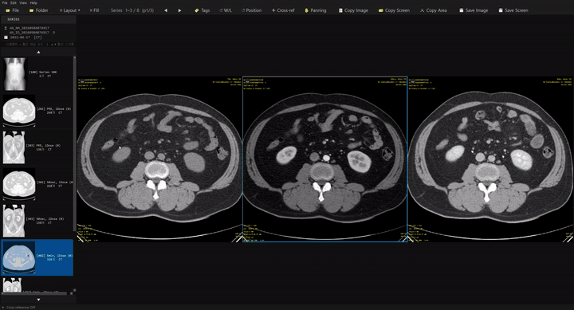

# Hwang Viewer for Radiologic Presentation — v4.1

강의 자료(PPT) 제작에 최적화된 가볍고 빠른 Windows DICOM 뷰어.
레이아웃 자유, 갭줄이기, 확대, 축소, cross-link 가능하고, 전체화면 캡쳐, 선택화면 캡쳐 모두 가능하고 클립보드에 붙습니다.
단일 Python 파일(`dicom_viewer.py`)로 실행 가능합니다.



---

## 설치

```bash
pip install -r requirements.txt
```

또는 직접:

```bash
pip install pydicom pyqt6 numpy pylibjpeg pylibjpeg-libjpeg pylibjpeg-openjpeg
```

## 실행

```bash
python dicom_viewer.py
```

## EXE 빌드 (배포용)

```
방법 1: build.bat 더블클릭 (Windows)
방법 2: .venv\Scripts\python.exe -m PyInstaller HwangViewer.spec
        → dist\HwangViewer.exe 생성 (~60–80 MB, Python 설치 불필요)
```

`build.bat`는 현재 폴더의 `.venv`를 자동으로 사용합니다. `.venv`가 없으면 새로 만들고, `requirements.txt`와 `pyinstaller`를 설치한 뒤 빌드합니다.

생성된 `HwangViewer.exe` 단일 파일을 다른 PC에 복사하면 Python 없이도 실행 가능합니다 (Windows 10/11 64-bit).

---

## 라이선스

Apache License 2.0으로 배포됩니다. 사용, 수정, 배포가 가능하며 라이선스 고지와 저작권 표시를 유지해야 합니다. 자세한 내용은 `LICENSE` 파일을 참고하세요.

---

## 주요 기능

### 툴바 구성

두 줄 툴바로 모든 기능에 마우스 한 번으로 접근 가능합니다.

**Row 1 — 파일 / 레이아웃 / 시리즈**

| 버튼 | 기능 |
|------|------|
| `📂 File` | DICOM 파일 열기 |
| `📁 Folder` | DICOM 폴더 열기 |
| `⊞ Layout ▾` | 레이아웃 드롭다운 선택 (9가지) |
| `⊞ Fill` | 현재 레이아웃에 남은 시리즈 자동 채우기 |
| `◀` / `▶` | 시리즈 페이지 이동 |

**Row 2 — 뷰 모드 / 캡처 / 저장**

| 버튼 | 기능 |
|------|------|
| `🏷️ Tags` | DICOM 태그 오버레이 ON/OFF |
| `↺ W/L` | 활성 패널 Window Level/Width 리셋 |
| `↺ Pos` | 모든 패널 Gap / Zoom / Pan 리셋 |
| `✣ X-ref` | Cross-reference 모드 ON/OFF |
| `✋ Pan` | Panning 모드 ON/OFF |
| `📋 Copy Img` | 활성 패널 클립보드 복사 |
| `🗂️ Copy Scr` | 전체 화면 클립보드 복사 |
| `✂️ Copy Area` | 영역 선택 클립보드 복사 |
| `💾 Save Img` | 활성 패널 PNG/JPG 저장 |
| `💾 Save Scr` | 전체 화면 PNG/JPG 저장 |

툴바는 **DPI-adaptive** — Windows 125%/150%/200% 디스플레이 스케일링에서 폰트와 아이콘 크기가 자동 조정됩니다.

### 단축키 도움말 (`F1`)

`F1` 또는 메뉴 `Help → Keyboard & Mouse Shortcuts...` 를 누르면 현재 선택된 언어로 전체 단축키 목록을 보여주는 스크롤 가능한 다이얼로그가 열립니다.

### 9가지 레이아웃

| 단축키 | 레이아웃 |
|--------|---------|
| `Ctrl+1` | 1×1 |
| `Ctrl+2` | 2×2 |
| `Ctrl+3` | 3×3 |

툴바 `⊞ Layout ▾` 드롭다운으로 9개 (1×1 / 1×2 / 1×3 / 2×1 / 2×2 / 2×3 / 3×1 / 3×2 / 3×3) 선택. `Space` 또는 패널 더블클릭으로 1×1 ↔ 다중 패널 토글.

### 시리즈 사이드바 & 자동 그룹핑

- 폴더 드롭 시 statusBar 좌측에 **진행률 표시줄** (Header scan → Thumbnails)
- **SeriesInstanceUID 기준 자동 그룹핑** — 시리즈 목록은 SeriesNumber 오름차순 정렬
- 각 항목: `[번호] 설명 (슬라이스 수)` 형식 (예: `[12] T1 AXIAL (43)`)
- 시리즈마다 **가운데 슬라이스 썸네일** 144×144 자동 생성
- ▲ ▼ **삼각형 버튼**으로 사이드바 스크롤 (길게 누르면 연속)
- 툴바 `◀ ▶`로 페이지 이동
- **1개 시리즈 + 다중 패널**: 같은 시리즈를 모든 패널에 균등 분배
- **여러 시리즈**: 각 패널에 다른 시리즈 자동 배치. 시리즈 수 ≥ 7개면 자동으로 `3×3`

### 다국어 지원

메뉴 `Language`에서 실시간 언어 전환. 선택 언어는 `settings.json`에 자동 저장.

| 코드 | 언어 |
|------|------|
| `ko` | 한국어 (기본값) |
| `en` | English |
| `es` | Español |
| `ja` | 日本語 |
| `zh` | 中文 |

### DWI b-value 필터링

Multi-b-value DWI 시리즈를 열면 패널 좌상단에 **b-value 배지**가 자동으로 나타납니다.

- 배지 클릭 → 해당 b-value 슬라이스만 필터링 (예: `b0`, `b1000`, `b2000`)
- `b▾` / `b▸` 토글로 배지 접기/펼치기
- **해부학적 위치 보존 스크롤** — 인터리브 DWI에서 스크롤 시 b-value 전환 없음
- Cross-reference 동기화도 b-value 필터와 함께 정상 작동

### 영상 조작

| 동작 | 기능 |
|------|------|
| **좌클릭 드래그 ↕** | 슬라이스 이동 (10px당 1장) |
| **우클릭 드래그 ↔** | Window Width |
| **우클릭 드래그 ↕** | Window Level |
| **가운데 드래그 ↕** | 확대/축소 (5px당 1단계) |
| **스크롤 휠** | 슬라이스 이동 |
| `Ctrl` + 휠 | 확대/축소 (1.15배) |
| `R` | 활성 패널 W/L 리셋 (zoom/pan 유지) |
| `Ctrl+G` | **Reset Position** — 모든 패널 Gap / Zoom / Pan / W/L 전체 리셋 |

오버랩/줌 상태에서도 마우스 커서 위치의 패널이 자동으로 활성/조작됨 (z-order 기반 hit-test).

### Panning 모드 (`P` 키)

| 동작 | 기능 |
|------|------|
| `P` 또는 툴바 `✋ Pan` | 모드 ON/OFF |
| 모드 ON + 좌클릭 드래그 | 영상 위치 이동 (1:1 비율) |
| 자석 효과 | 인접 패널 이미지 가장자리 3px 이내에 자동 정렬 |

### 패널 갭 / 오버랩

| 동작 | 기능 |
|------|------|
| **Shift + 좌클릭 드래그** | 패널을 가운데/바깥 이동 (한 번에 한 축) |
| `Ctrl+G` | Reset Position |
| View → 이미지 이동 설정... | 픽셀 수동 입력 |

**Two-Phase 오버랩**: letterbox 축소 → 이미지 인접 → 실제 오버랩 순으로 진행.
확대해도 갭 유지 (letterbox 클리핑).

### Cross-reference (`X` 키)

- 패널 좌클릭 → 3D 월드 좌표 계산
- 다른 패널들이 자동으로 가장 가까운 슬라이스로 이동 + 시안 십자선/원
- Axial ↔ Sagittal ↔ Coronal 간에도 작동

### DICOM 태그 오버레이 (`T` 키)

| 위치 | 표시 |
|------|------|
| 상단 좌 | 환자명 / ID / 성별·나이 / 검사일 / Modality |
| 상단 우 | Series Description / Sequence / Series # |
| 하단 좌 | Img/Total / Loc / Thickness / Pixel / 해상도 |
| 하단 우 | TR / TE / FA (MRI), kV / mA (CT) |
| 항상 | WL / WW / Zoom 배율 |

### 캡처 / 클립보드

| 단축키 | 기능 |
|--------|------|
| `Ctrl+C` | 활성 패널 → 클립보드 |
| `Ctrl+Shift+C` | 전체 화면 → 클립보드 (테두리·사이드바·툴바 자동 제외) |
| `Ctrl+Alt+C` | 영역 선택 → 클립보드 (사각형 드래그, Esc 취소) |
| `Ctrl+S` | 활성 패널 PNG/JPG 저장 |
| `Ctrl+Shift+S` | 전체 화면 PNG/JPG 저장 |

활성 패널 파란 테두리 + Cross-reference 십자선은 **모든 캡처에서 자동 제거**.
HiDPI(125%/150%/200% 스케일) 환경에서도 영역 정확히 캡처.

---

## 전체 단축키

| 키 | 기능 |
|----|------|
| `F1` | 단축키 도움말 다이얼로그 |
| `Space` | 1×1 ↔ 다중 패널 토글 |
| `P` | Panning ON/OFF |
| `X` | Cross-reference ON/OFF |
| `T` | DICOM 태그 오버레이 ON/OFF |
| `R` | W/L 리셋 (활성 패널만) |
| `Ctrl+G` | Reset Position (전체) |
| `Ctrl+1/2/3` | 1×1 / 2×2 / 3×3 |
| `Ctrl+C` / `Ctrl+Shift+C` / `Ctrl+Alt+C` | Copy Image / Screen / Area |
| `Ctrl+S` / `Ctrl+Shift+S` | Save Image / Screen |
| `Ctrl+O` / `Ctrl+Shift+O` | Open File / Folder |
| `↑↓←→` | 슬라이스 이동 |
| **Shift + 좌클릭 드래그** | 패널 갭 조절 |
| **우클릭 드래그** | WW (↔) / WL (↕) |
| **가운데 버튼 드래그** | 확대/축소 |

---

## 파일 구성

```
dicom_viewer.py    — 메인 소스 (단일 파일, ~3950줄)
settings.json      — 언어 설정 저장 (자동 생성)
HwangViewer.spec   — PyInstaller 빌드 설정
build.bat          — Windows EXE 빌드 스크립트
requirements.txt   — 의존 패키지
README.md          — 본 문서
```

---

## 앞으로의 개발예정
### V4.x
#### Multiple ROI at group selection
- Group selection시 ROI를 하나에서만 그리면 동시에 그려짐
- native DICOM 좌표에 맞게

#### Measurements Export to CSV
- Measured ROI, length 등을 CSV 로 추출
- 연구 데이터 확보에 용이

### V5
- Radiomics module 개발
- 본격적 연구 이전 testing
- 통계적 지원 

## v4.1 변경 사항 (v4.0 대비)

### Annotation 편집성 강화

- 기존 annotation을 툴 선택 없이 직접 클릭/드래그해서 다시 이동할 수 있습니다.
- ROI, length, arrow, text annotation 모두 직접 이동을 지원합니다.
- ROI를 이동하면 현재 위치 기준으로 통계값을 다시 계산합니다.
- ROI 통계 박스와 length label 박스는 본체와 별도로 위치를 드래그 조정할 수 있습니다.
- `CLR Ann`은 활성 패널 annotation 삭제, `CLR All Ann`은 전체 패널 annotation 삭제로 분리했습니다.

### Overlay 표시 개선

- `T` 키가 3단계로 동작합니다: DICOM header + annotation 표시 → annotation만 표시 → 모두 숨김.
- DICOM overlay의 `Pixel`, image size, `WL/WW/Zoom` 라인에서 깨지던 곱하기 표기를 `x`로 정리했습니다.

### UI 및 실행 안정화

- 기존 toolbar는 아이콘 문자와 텍스트를 함께 표시하고, annotation 기능에는 전용 그림 아이콘을 추가했습니다.
- toolbar font를 줄이고 row overflow 배치를 보정했습니다.
- `run_viewer.bat` 실행 시 콘솔을 UTF-8로 맞춰 `[TIMER]` 한글 로그가 깨지지 않도록 했습니다.

---

## v4.0 변경 사항 (v3.11 대비)

### 새 기능

- **Annotation overlay** — 영상 위에 별도 overlay layer로 annotation을 표시합니다. Zoom, pan, layout 변경 시 원본 image 좌표계를 기준으로 다시 그립니다.
- **Size measurement** — 두 점 사이 길이를 측정합니다. `PixelSpacing`이 있으면 mm, 없으면 px 단위로 표시합니다.
- **Arrow annotation** — 드래그 방향으로 화살표를 그립니다.
- **Text annotation** — 클릭 위치에 텍스트 label을 추가합니다.
- **Ellipse ROI** — 드래그한 방향과 크기에 따라 원형 또는 타원형 ROI를 그리고 통계를 표시합니다.
- **ROI statistics** — ROI 면적, mean, min, max, SD를 표시합니다. CT는 HU, 그 외 modality는 SI로 표시합니다.

### 조작

- Toolbar의 `Measure`, `Arrow`, `Text`, `ROI` 중 하나를 선택한 뒤 영상 위에서 클릭/드래그합니다.
- `Delete` 또는 `Backspace`로 현재 slice의 마지막 annotation을 삭제합니다.
- `Clear Ann`으로 활성 패널의 annotation을 모두 지웁니다.
- `Esc`로 annotation tool을 끕니다.

## v3.11 변경 사항 (v3.1 대비)

### 새 기능

- **툴바 폰트 자동 확장** — 한 줄 툴바에 여백이 있을 때 폰트를 키워서 공간을 채움. 여백이 부족하면 두 줄로 전환하는 기존 동작 유지
- **Shift+클릭 그룹 동기화 토글** — Shift+드래그(갭 조절)와 구분하여 Shift+클릭(드래그 없음) 시 ∞ 그룹 sync 추가/제거
- **∞ 동기화 배지 위치 변경** — 우하단 → 좌상단. 오버랩 모드에서 우측이 덮여도 배지가 항상 보임

### 버그 수정

- **∞ 동기화 배지 손 모양 커서** — 배지에 마우스 올리면 `PointingHandCursor` 표시 (이전엔 부모 패널 커서 그대로)
- **오버랩 모드 좌측 컬럼 클릭 정확도** — Shift+드래그로 패널을 겹치기 직전까지 좁혔을 때 좌측 컬럼 클릭이 가운데 컬럼으로 오인되던 문제 수정. `children()` z-order 기반 hit-test 적용

---

## v3.1 변경 사항 (v3.0 대비)

### 성능 개선

- **헤더 스캔 ProcessPoolExecutor 적용** — `ThreadPoolExecutor(8)` → `ProcessPoolExecutor(cpu_count)`. Python GIL 우회로 pydicom 파싱이 진짜 병렬로 동작. 3682파일 기준 34s → ~5s (CPU 코어 수에 따라 상이)
- **폴더 경로 기반 헤더 캐시** — 같은 폴더를 두 번째 열 때 1단계 스캔 전체 스킵, 즉시 로드. 파일 수 변경 시 자동 무효화
- **PyInstaller EXE 호환** — `multiprocessing.freeze_support()` 추가로 EXE 빌드에서도 ProcessPoolExecutor 정상 작동

### 타이머 출력 개선

```
[TIMER] 1단계 헤더 스캔:    0.000s  (3682파일, 3650성공) [캐시 히트]
```

---

## v3.0 변경 사항 (v2.1 대비)

### 새 기능

- **다국어 지원** — 한국어·영어·스페인어·일본어·중국어 실시간 전환. `Language` 메뉴에서 선택, `settings.json`에 자동 저장
- **단축키 도움말 다이얼로그 (`F1`)** — 현재 언어에 맞는 전체 단축키 목록을 스크롤 가능한 다이얼로그로 표시
- **DPI-adaptive 툴바** — Windows 125%/150%/200% 디스플레이 스케일링 환경에서 폰트·아이콘 크기 자동 조정. 텍스트 클리핑 방지 anti-clipping 로직 포함
- **두 줄 툴바** — Row 1(파일/레이아웃/시리즈)과 Row 2(뷰모드/캡처/저장)로 분리, 전체 기능을 버튼 한 번으로 접근
- **DWI b-value 필터링** — Multi-b-value DWI에서 b-value 배지 자동 표시 및 필터링, 해부학적 위치 보존 스크롤
- **시리즈 자동 그룹핑** — SeriesInstanceUID 기준 그룹, SeriesNumber 정렬

### 버그 수정

- **인터리브 DWI 슬라이스 점프 수정** — 휠 스크롤 시 b-value 의도치 않은 전환 방지
- **Cross-reference 브로드캐스트 루프 방지** — 다중 패널 동기화 스크롤 무한 루프 수정

---

## v2.1 변경 사항 (v2 대비)

### 새 기능
- **Panning 모드** (`P` 키) — 확대/갭 조절 후 영상 위치 미세 조정 + 인접 패널 가장자리 자석 정렬
- **Reset Position** (`Ctrl+G`) — 갭/zoom/pan/WL 전체 리셋
- **Copy Area** (`Ctrl+Alt+C`) — 화면에서 사각형 영역 직접 선택하여 클립보드 복사, HiDPI 정확도 보정
- **Reset W/L** (`R`) — 활성 패널의 W/L만 리셋, zoom/pan 유지

### 정확도 / UX 개선
- **z-order 기반 hit-test** — 갭 줄임/오버랩 상태에서 마우스 커서 위 패널 정확히 활성화
- **Zoom 시 letterbox 클리핑** — 확대해도 인접 패널 영역 침범 안 함
- **Cross-ref 좌표 정확도** — zoom + pan 후에도 정확한 클릭 위치 반영
- **HiDPI 영역 캡처 보정** — Windows 디스플레이 스케일링 환경에서 정확한 영역 캡처

### 안정성
- 마우스 이벤트 forwarding을 직접 method dispatch 방식으로 (PyQt6 버전 호환성)
- 빌드 스크립트 ASCII + CRLF (Windows cmd 인코딩 문제 방지)
